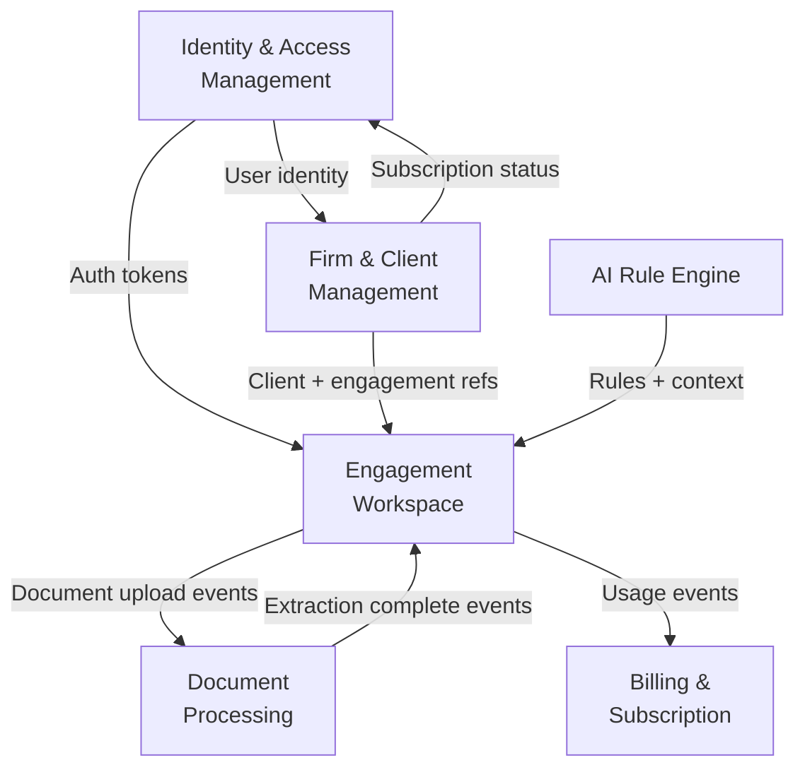

# Bounded Contexts — TaxWijs

> Domain-Driven Design bounded context map: the six bounded contexts, their aggregates, and how they communicate.

---

## 1. Context Map

---

## 2. Context Definitions

### 2.1 Identity & Access Management (IAM)

**Purpose:** Authenticate users, authorize actions, manage sessions and API keys.

**Aggregates:**
- `User` — email, password hash, MFA settings, email_verified
- `Role` — system roles: admin, firm_manager, accountant, client, tax_sme
- `UserRoleAssignment` — user ↔ role ↔ firm (scoped)
- `UserSession` — JWT session tracking
- `Invitation` — email invite → account creation
- `APIClient` — machine-to-machine OAuth2 clients
- `FeatureFlag` — per-user or per-firm feature gates

**Owns:** `users`, `roles`, `permissions`, `user_role_assignments`, `user_sessions`, `invitations`, `api_clients`, `feature_flags`

**Ubiquitous language:** Principal, Role, Permission, Session, Invitation, API Client

---

### 2.2 Firm & Client Management

**Purpose:** Model accounting firms, their clients, and firm membership.

**Aggregates:**
- `Firm` — accounting firm: name, KVK, branding, subscription
- `FirmMembership` — user ↔ firm association
- `Client` — end client (ZZP worker, employee, expat, DGA)
- `ClientProfile` — detailed personal/business info per client
- `TaxProfile` — client's tax situation type, selected tax year
- `TaxYear` — which years are active for a client

**Owns:** `firms`, `firm_memberships`, `clients`, `client_profiles`, `tax_profiles`, `tax_years`

**Ubiquitous language:** Firm, Member, Client, Tax Profile

---

### 2.3 Engagement Workspace

**Purpose:** The core work unit — an annual tax engagement for one client in one year. Tracks readiness, checklists, tasks, and communications.

**Aggregates:**
- `Engagement` — (client, firm, tax_year) primary work unit
- `EngagementStatusHistory` — state machine log
- `ReadinessSnapshot` — computed score + components
- `ChecklistTemplate` — reusable checklist definitions per persona
- `ChecklistItem` — per-engagement item (status: todo/uploaded/accepted/waived)
- `DocumentRequest` — linked doc requirement (mirrors checklist with stable_key `req_*`)
- `Task` — accountant action items
- `MessageThread` — conversation thread on an engagement
- `Message` — individual message within a thread
- `Comment` — annotation on any resource

**Owns:** `engagements`, `engagement_status_history`, `readiness_snapshots`, `checklist_templates`, `checklist_items`, `checklist_item_states`, `document_requests`, `tasks`, `message_threads`, `messages`, `comments`

**Ubiquitous language:** Engagement, Readiness Score, Checklist, Task, Thread

**Key invariant:** Readiness score formula: `score = doc_score×0.40 + checklist_score×0.30 + verification_score×0.20 + accountant_review_score×0.10`. DocumentRequest with stable_key `req_{checklist_key}` inherits the checklist item's accepted/waived status for doc_score.

---

### 2.4 Document Processing

**Purpose:** Upload, classify, OCR, extract fields, and validate documents. Human review for low-confidence results.

**Aggregates:**
- `Document` — uploaded file (PDF/image)
- `DocumentVersion` — version chain for re-uploads
- `DocumentClassification` — AI classifier result (type + confidence)
- `DocumentExtraction` — full extraction result record
- `ExtractedField` — one field (key, raw, normalized, confidence)
- `ExtractionReview` — human review decision
- `ValidationRule` — per-field validation rules (format, range, cross-doc)
- `PipelineRun` — execution log for OCR pipeline

**Owns:** `documents`, `document_versions`, `document_classifications`, `document_extractions`, `extracted_fields`, `extraction_reviews`, `validation_rules`, `pipeline_runs`

**Ubiquitous language:** Document, Classification, Extraction, Field Confidence, Review

---

### 2.5 AI Rule Engine

**Purpose:** Manage tax rules, embeddings, retrieval, and Claude AI responses.

**Aggregates:**
- `RuleSet` — yearly collection of tax rules
- `Rule` — single tax rule with condition/result/source
- `RuleVersion` — version history for a rule
- `RuleTestCase` — test case for a rule (input → expected output)
- `DeductionOpportunity` — identified optimization for a client
- `EvidenceRequirement` — what a client must submit to claim a deduction
- `ModelVersion` — track which ML model is in use
- `PromptVersion` — track which AI prompt version was used
- `RAGDocument` — document in the RAG corpus
- `RAGChunk` — individual chunk in the vector store
- `EmbeddingsIndexMetadata` — embedding model name/version record

**Owns:** `rule_sets`, `rules`, `rule_versions`, `rule_test_cases`, `deduction_opportunities`, `evidence_requirements`, `model_versions`, `prompt_versions`, `rag_documents`, `rag_chunks`, `embeddings_index_metadata`

**Ubiquitous language:** Rule, Deduction Opportunity, Evidence, Confidence, Chunk, Embedding

---

### 2.6 Billing & Subscription

**Purpose:** Manage firm subscriptions, usage tracking, and invoicing.

**Aggregates:**
- `Subscription` — firm plan (tier, limits, renewal date)
- `Invoice` — billing invoice
- `UsageRecord` — API/feature usage tracking per firm
- `Webhook` — outbound webhook configuration
- `Notification` — in-app notification

**Owns:** `subscriptions`, `invoices`, `usage_records`, `webhooks`, `notifications`

**Ubiquitous language:** Plan, Subscription, Invoice, Usage

---

## 3. Cross-Cutting Concerns

These live outside any single bounded context:

| Concern | Implementation |
|---------|---------------|
| Audit logging | `audit_log` table — immutable, all contexts write to it |
| GDPR/Privacy | `consent_records`, `retention_policies`, `data_subject_requests` |
| Incidents | `incidents` table — ops context |

---

## 4. Context Integration Patterns

| From | To | Pattern | Event/API |
|------|----|---------|-----------|
| IAM | All | Synchronous | JWT bearer token validation |
| FirmCtx | EngagCtx | Synchronous | `GET /api/portal/clients/{id}/` |
| EngagCtx | DocCtx | Event | `document.upload_requested` |
| DocCtx | EngagCtx | Event | `document.extraction_complete` |
| DocCtx | EngagCtx | Event | `document.needs_review` |
| AICtx | EngagCtx | Synchronous | `POST /api/ai/chat/` (retrieve + respond) |
| EngagCtx | BillingCtx | Event | `engagement.completed` (triggers usage record) |
| BillingCtx | IAM | Synchronous | `GET /api/billing/subscription/` (feature gate check) |
