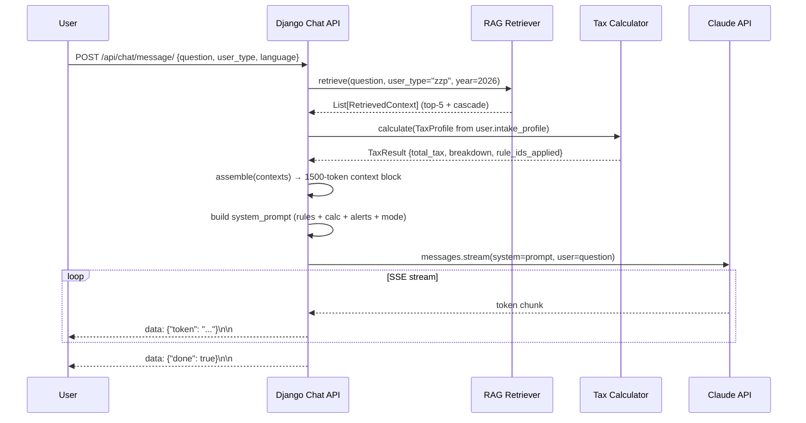

# AI Architecture — TaxWijs

> This document describes the complete AI subsystem for TaxWijs: how the RAG pipeline, Claude AI response layer, OCR document pipeline, deterministic tax calculator, and rule engine interact.

---

## 1. Core Principle

**The AI never computes numbers.** Every tax calculation is performed by the deterministic Phase 3 calculator, which reads all rates and thresholds from `phase1/data/seed/tax_rules_2026.json`. The AI reads calculator output, explains it, and cites sources. This separation is never violated.

---

## 2. Component Overview

```mermaid
graph TB
    User["User (NL/EN/FA)"]
    ChatAPI["POST /api/chat/message/\n(Django SSE endpoint)"]
    RAG["Phase 2: RAG Pipeline\nChromaDB + multilingual-mpnet"]
    Calc["Phase 3: Tax Calculator\nDeterministic Python"]
    Claude["Claude API\nclaude-sonnet-4-6"]
    OCR["OCR Pipeline\n(AWS Textract / Google DocAI)"]
    Rules["Phase 1: Knowledge Base\ntax_rules_2026.json"]
    DB["PostgreSQL\n(audit, profiles, engagements)"]

    User -->|HTTPS POST + SSE stream| ChatAPI
    ChatAPI -->|retrieve(question, user_type, year)| RAG
    ChatAPI -->|calculate(profile)| Calc
    RAG -->|vector search| ChromaDB["ChromaDB\n(local dev)\nor pgvector (prod)"]
    Calc -->|reads| Rules
    RAG -->|reads| Rules
    ChatAPI -->|assembled context + system prompt| Claude
    Claude -->|streamed tokens| ChatAPI
    ChatAPI -->|SSE chunks| User
    OCR -->|extracted fields| DB
    DB -->|user profile + intake| ChatAPI
```

---

## 3. Component Responsibilities

### 3.1 RAG Pipeline (Phase 2)

| Component | File | Responsibility |
|-----------|------|----------------|
| Chunkers | `phase2/chunkers/` | Convert Phase 1 JSON → embeddable Chunk objects |
| Embedder | `phase2/embeddings/embed_local.py` | `paraphrase-multilingual-mpnet-base-v2` (768-dim, offline) |
| Vector Store | `phase2/store/chroma_store.py` | ChromaDB persistent local (dev), Supabase pgvector (prod) |
| Retriever | `phase2/retriever.py` | `retrieve(question, user_type, year)` → List[RetrievedContext] |
| Assembler | `phase2/assembler.py` | Formats chunks → 1,500-token context string |

**Embedding model selection rationale:** `paraphrase-multilingual-mpnet-base-v2` (sentence-transformers) was chosen over OpenAI `text-embedding-3-small` because: (1) it runs fully offline with no API cost per embedding, (2) it maps NL/EN/FA queries into the same vector space enabling cross-lingual retrieval, (3) 768 dimensions is sufficient for the ~113-chunk corpus. OpenAI embeddings remain available as `phase2/embeddings/embed_openai.py` for production upgrade.

### 3.2 Tax Calculator (Phase 3)

- **Entry point:** `phase3/calculator/full_calculation.py::calculate(profile: TaxProfile) → TaxResult`
- **Data source:** reads ALL values from `phase1/data/seed/tax_rules_2026.json` via `phase3/data_loader.py`
- **User types:** zzp, employee, expat, dga
- **Never hardcodes** a single tax rate, bracket, or threshold
- **All 6 seed scenarios** pass with 0.0% error (validated by `phase3/test_scenarios.py`)

### 3.3 Claude AI Response Layer (Phase 4)

- **Endpoint:** `backend/apps/chat/views.py` — `StreamingHttpResponse` (text/event-stream)
- **Model:** `claude-sonnet-4-6` via Anthropic API
- **Mock mode:** activates automatically when `ANTHROPIC_API_KEY` is not set; returns realistic streamed mock tokens
- **Three modes:**
  - Default: RAG context + calculator result + health alerts → tax Q&A
  - `intake_mode=true`: Alex persona collects tax profile; emits `[INTAKE_COMPLETE: {...}]`
  - `ib_return_mode=true`: guided IB form walkthrough; emits `[IB_COMPLETE: {...}]`

### 3.4 OCR Pipeline

See `docs/05-ai-rule-engine/ocr-and-document-pipeline.md` for full pipeline spec.

- **Abstraction layer:** `backend/apps/portal/ocr/base.py` — `OCRProvider` interface
- **Supported providers:** AWS Textract, Google Document AI (vendor-switchable)
- **Output:** `ExtractedIncome`, `ExtractedExpense`, field-level records in PostgreSQL

---

## 4. AI Response Flow (Sequence)



---

## 5. Technology Decisions

| Decision | Choice | Rationale |
|----------|--------|-----------|
| AI response model | Claude (Anthropic) `claude-sonnet-4-6` | Best multilingual reasoning, RTF format, streaming support, Dutch tax accuracy |
| Embedding model | `paraphrase-multilingual-mpnet-base-v2` | Offline, multilingual, adequate for 113-chunk corpus |
| Vector store (dev) | ChromaDB persistent local | Zero infra, instant setup, adequate for small corpus |
| Vector store (prod) | Supabase pgvector | SQL + vector in one DB, avoids separate vector infra |
| Calculator | Deterministic Python (Phase 3) | Zero hallucination risk, 0% error on all 6 scenarios |
| OCR | Vendor abstraction (`OCRProvider`) | Switch between AWS Textract and Google DocAI without code changes |
| Streaming | Django `StreamingHttpResponse` (SSE) | Native Django, no WebSocket server needed |

---

## 6. Failure Modes and Fallbacks

| Failure | Detection | Fallback |
|---------|-----------|----------|
| `ANTHROPIC_API_KEY` missing | Startup check | Auto-enable mock mode (streamed realistic tokens) |
| ChromaDB not initialized | `retrieve()` raises | Return empty context; AI answers from general knowledge with caveat |
| Calculator error | Exception in `calculate()` | Return error message; AI does not estimate numbers |
| RAG precision drops | Nightly eval job | Alert; re-index with `phase2/build_index.py` |
| Claude API rate limit | 429 response | Exponential backoff (3 retries), then 503 to client |
| OCR vendor down | Timeout / 5xx | Queue job for retry; notify accountant via task |

---

## 7. Privacy and Data Controls

- **PII never enters ChromaDB.** Only tax rule text, Q&A pairs, and scenarios are embedded.
- **PII never enters Claude prompts.** The system prompt contains tax rules and calculator results, not client name/BSN.
- **Calculator inputs** (income, assets) are sent to Claude as aggregated numbers only, never with identifying fields.
- **Source URLs** from verified `belastingdienst.nl` domains only — never from unverified sources.
- **Persian text** requires UTF-8 encoding everywhere; all file I/O uses `encoding="utf-8"`.
