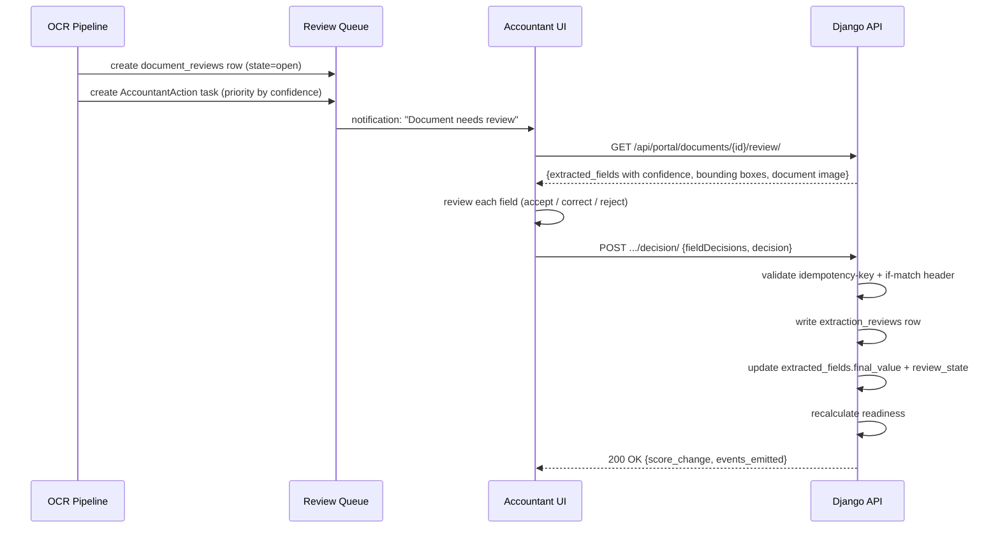

# Human-in-the-Loop Specification — TaxWijs

> Defines when human review is mandatory, how review flows work, override rules, and audit requirements.

---

## 1. Mandatory Human Review Cases

The following cases must NEVER auto-finalize regardless of confidence score:

| Case | Reason | Who Reviews |
|------|--------|------------|
| Box 2 income (DGA dividend) > €10,000 | High financial impact; tax law complexity | Accountant + Firm Manager |
| First-time client (no prior year baseline) | No historical data for cross-validation | Accountant |
| Contradictory evidence across documents | System cannot resolve automatically | Accountant |
| Any mandatory field confidence < 0.60 | Insufficient certainty for tax filing | Accountant |
| Wet DBA risk score = "high" | Legal compliance risk | Accountant |
| DSAR (data subject access request) fulfillment | Legal requirement for human oversight | Admin |
| BSN or IBAN validation failure | Identity/account mismatch | Accountant |
| Documents from non-Dutch sources | Requires specialized knowledge | Accountant |
| Tax year > 1 year old (prior-year amendment) | Complex retroactive implications | Accountant + Tax SME |

---

## 2. Low-Confidence Review Flow

**Trigger:** `composite_confidence < 0.75` OR any mandatory field confidence < 0.60



---

## 3. Review Lock Management

To prevent two accountants reviewing the same document simultaneously:

```python
# Lock is set when accountant opens the review
document_reviews.locked_by = current_user_id
document_reviews.lock_expires_at = now() + timedelta(minutes=30)
document_reviews.state = "locked"

# Second accountant gets:
# HTTP 409 {"error": {"code": "REVIEW_LOCKED", "locked_by": "Sara de Vries", "expires_at": "..."}}

# If lock expires: automatically release, allow next accountant to lock
# Lock auto-extends by 5 minutes on each field decision action
```

Concurrency control on submission uses optimistic locking:
- Client sends `If-Match: "{review_version}"` header
- API rejects with 409 if `review_version` has advanced since client loaded

---

## 4. Accountant Override Flow

Accountants can override AI decisions at any point before filing.

| What Can Be Overridden | Override Type | Requires |
|-----------------------|--------------|----------|
| Extracted field value | Correction | Accountant role |
| Document classification type | Reclassification | Accountant role |
| Deduction opportunity accepted/dismissed | Disposition | Accountant role |
| Readiness score component | Score override | Firm Manager role |
| Rule interpretation | Annotation | Tax SME + Firm Manager |

**Override audit requirements:**
Every override must record:
- `reviewer` (user_id)
- `timestamp` (ISO 8601)
- `old_value`
- `new_value`
- `reason_code` (from dropdown: `ocr_error`, `format_difference`, `different_interpretation`, `client_correction`, `other`)
- `reason_text` (free text, optional)

---

## 5. Client Correction Flow

When a client re-uploads a document (e.g., they submitted the wrong year):

1. Client uploads new document via `POST /api/portal/documents/upload/`
2. System checks for existing document of same type for same engagement
3. If found: old document status → `superseded`; new document triggers full pipeline
4. Accountant notified: "Document superseded — new version requires review"
5. Any review decision on the old document is archived (not deleted)
6. Readiness recalculated using only the latest approved document

---

## 6. Cases That Must Never Auto-Finalize

Beyond the cases in Section 1, the following computational results must never be auto-applied to a tax return without accountant sign-off:

| Result | Threshold |
|--------|----------|
| Total tax due estimate | Always requires accountant_confirmed = True |
| Box 2 dividend tax | Always manual |
| Box 3 wealth tax | Always manual |
| Deduction > €5,000 | Accountant must accept the opportunity explicitly |
| ZVW bijdrage calculation | Must be presented as a liability, not auto-deducted |

---

## 7. Audit Log Requirements

Every human review action generates an immutable `audit_log` row:

```json
{
  "action": "DOCUMENT_FIELD_CORRECTED",
  "resource_type": "extracted_fields",
  "resource_id": "uuid-of-field",
  "user_id": "uuid-of-accountant",
  "old_value": {"normalized_value": "5800.00", "confidence": 0.72},
  "new_value": {"normalized_value": "58800.00", "review_state": "corrected"},
  "ip_address": "10.0.1.42",
  "request_id": "req_abc123",
  "created_at": "2026-06-13T10:15:42Z"
}
```

Audit logs are:
- Immutable (no UPDATE or DELETE ever)
- Retained for 5 years
- Exportable per engagement for client records
- PII-masked in log exports (BSN shown as `BSN-***`, amounts shown in full)
