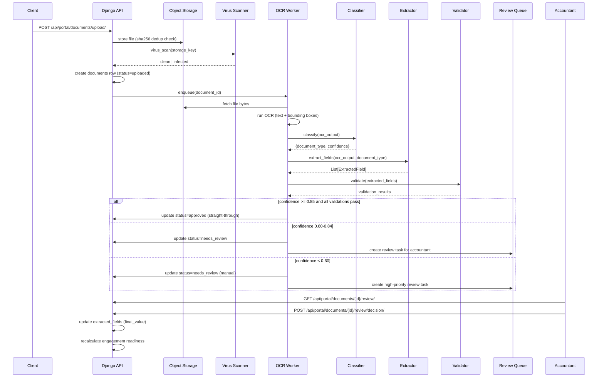

# OCR and Document Pipeline — TaxWijs

> End-to-end specification for document ingestion, OCR, classification, extraction, validation, review, and archiving.

---

## 1. Pipeline Overview



---

## 2. Supported Document Types

| Code | Dutch Name | English Name | Key Extracted Fields |
|------|-----------|--------------|----------------------|
| `JAAROPGAVE` | Jaaropgave | Annual income statement | gross_salary, tax_withheld, employer_name, bsn, year |
| `BTW_AANGIFTE` | BTW-aangifte | VAT return | period, taxable_turnover, vat_due, vat_paid |
| `BANKAFSCHRIFT` | Bankafschrift | Bank statement | account_iban, period_start, period_end, opening_balance, closing_balance |
| `FACTUUR_INKOMEND` | Inkomende factuur | Purchase invoice | supplier, amount_excl_btw, btw_amount, total, date, btw_number |
| `FACTUUR_UITGAAND` | Uitgaande factuur | Sales invoice | client, amount_excl_btw, btw_amount, total, invoice_number, date |
| `WOZ_BESCHIKKING` | WOZ-beschikking | Property value statement | woz_value, reference_date, address |
| `HYPOTHEEKJAAROPGAVE` | Hypotheekjaaropgave | Mortgage annual statement | lender, outstanding_balance, interest_paid, year |
| `PENSIOENOPGAVE` | Pensioenopgave | Pension statement | provider, premium_paid, year, policy_number |
| `DIVIDENDBEWIJS` | Dividendbewijs | Dividend certificate | issuer, dividend_amount, tax_withheld, date |
| `KVK_UITTREKSEL` | KVK-uittreksel | Chamber of Commerce extract | kvk_number, legal_name, address, sbi_code, registered_date |
| `UNKNOWN` | Onbekend | Unknown document | (manual review required) |

---

## 3. Pipeline Steps — Detailed Specification

### Step 1: Upload and Storage

**Trigger:** `POST /api/portal/documents/upload/`  
**Actor:** Client or Accountant  
**Input:** multipart/form-data (file + engagement_id)  
**Output:** `document` row in DB (status=`uploaded`)

Processing:
1. Validate file type (allowed: PDF, JPG, PNG, XLSX — reject others with 422)
2. Compute SHA-256 hash → check `documents.sha256_hash` for duplicates
3. If duplicate found: create `document_versions` row pointing to new upload; flag `duplicate_of`
4. Store file at `{firm_id}/{client_id}/{year}/{uuid}.{ext}` in object storage
5. Insert `documents` row with status=`uploaded`
6. Emit `DOCUMENT_UPLOADED` event

**Latency SLA:** < 5 seconds for files up to 20MB  
**Error handling:** 413 for files > 50MB; 422 for disallowed types; 409 for exact duplicate (same hash)

---

### Step 2: Virus Scan

**Trigger:** After storage, before OCR  
**Actor:** Automated (ClamAV or cloud AV)  
**Input:** storage_key  
**Output:** clean | infected

- If infected: update `documents.status = rejected`, emit `DOCUMENT_REJECTED` with reason=`virus_detected`
- If clean: enqueue OCR job
- **Never skip** virus scan even if client is trusted firm employee

---

### Step 3: OCR

**Trigger:** Clean virus scan  
**Actor:** OCR Worker service  
**Latency SLA:** < 30s for single-page PDF; < 120s for 20-page document  
**Retry:** 3 attempts with exponential backoff (1s, 4s, 16s)

**Vendor abstraction (OCRProvider interface):**
```python
class OCRProvider:
    def process(self, file_bytes: bytes, mime_type: str) -> OCRResult:
        ...

class OCRResult:
    text: str
    pages: List[OCRPage]
    confidence: float
```

**Vendor decision matrix:**

| Criterion | AWS Textract | Google Document AI |
|-----------|-------------|-------------------|
| Dutch language support | ✅ Good | ✅ Excellent |
| Forms extraction | ✅ AnalyzeDocument | ✅ Form Parser |
| Tables | ✅ | ✅ |
| Handwriting | ⚠️ Limited | ✅ Good |
| Pricing (per page) | $0.015 | $0.065 (specialized) |
| Data residency (EU) | ✅ eu-west-1 | ✅ europe-west4 |
| **Recommended** | **Default** | **Fallback** |

**Output:** raw OCR text + bounding boxes stored in `document_extractions.raw_payload` (JSONB)

---

### Step 4: Classification

**Trigger:** OCR complete  
**Method:** Few-shot prompt to Claude with first-page OCR text; returns document_type + confidence

**Prompt pattern:**
```
Given this OCR text from a Dutch tax document, classify it.
Possible types: JAAROPGAVE, BTW_AANGIFTE, BANKAFSCHRIFT, FACTUUR_INKOMEND, 
FACTUUR_UITGAAND, WOZ_BESCHIKKING, HYPOTHEEKJAAROPGAVE, PENSIOENOPGAVE, 
DIVIDENDBEWIJS, KVK_UITTREKSEL, UNKNOWN
Return JSON: {"document_type": "...", "confidence": 0.XX, "reasoning": "..."}
```

**Output:** `document_classifications` row; update `documents.document_type` and `documents.classification_confidence`

---

### Step 5: Field Extraction

**Trigger:** Classification complete (confidence ≥ 0.50; else skip extraction, mark UNKNOWN)  
**Method:** Structured extraction prompt per document_type using OCR text + bounding box hints

**Normalization rules:**
- Currency: `"€ 58.800,-"` → `58800.00` (strip €, replace `.` thousands sep, `,` → `.` decimal)
- Date: `"1 januari 2026"` → `2026-01-01`; `"01-01-2026"` → `2026-01-01`
- BSN: validate with 11-check (elfproef); store encrypted
- IBAN: normalize to `NLxxBANKxxxxxxxxxx` format

**Output:** `extracted_fields` rows per field with `confidence`, `raw_value`, `normalized_value`, `bounding_box`

---

### Step 6: Validation

**Trigger:** Extraction complete  
**Rules applied per field type:**

| Field Type | Validation |
|------------|-----------|
| BSN | 11-check (elfproef) algorithm |
| IBAN | ISO 13616 checksum |
| Tax year | must match `engagement.tax_year` ± 0 (flag mismatch if ≠) |
| Currency amounts | must be > 0; must be < €10,000,000 (sanity cap) |
| Gross salary | cross-check against bank deposits ± 10% if bank statement also present |
| BTW number | format: NLxxxxxxxxB01 |

**Tax year mismatch:** if `document.tax_year_detected ≠ engagement.tax_year`, create `AccountantAction` with priority=high, title="Document year mismatch — verify".

---

### Step 7: Confidence Threshold Routing

| Overall Confidence | Action |
|-------------------|--------|
| ≥ 0.90 | Auto-approve (straight-through) |
| 0.75 – 0.89 | Flag for accountant spot-check (low-priority review task) |
| 0.60 – 0.74 | Require accountant review (medium-priority) |
| < 0.60 | Manual processing only (high-priority review task, no auto fields applied) |

---

### Step 8: Review (Accountant)

See `human-in-loop-spec.md` for full review workflow.

---

### Step 9: Approval and Archiving

After approved:
- Update `documents.status = approved`
- Copy `extracted_fields.normalized_value` where `review_state IN (accepted, corrected)` into engagement's derived tax data
- Emit `DOCUMENT_APPROVED` event → triggers readiness recalculation
- Trigger deduction scanner on updated engagement data

**Supersession:** if a new version of the same document is uploaded, old version status → `superseded`. Only latest approved version contributes to readiness.

---

### Step 10: Retention and Deletion

- Documents retained for 7 years (Dutch bookkeeping law, Wet op de bewaarplicht)
- Soft delete: `documents.deleted_at` set; file remains in storage
- Hard delete: only after retention period expires or DSAR erasure request
- Erasure: file deleted from storage; DB row anonymized (filename → `[deleted]`, hash cleared)
- Audit log entry created for every delete/anonymize action
