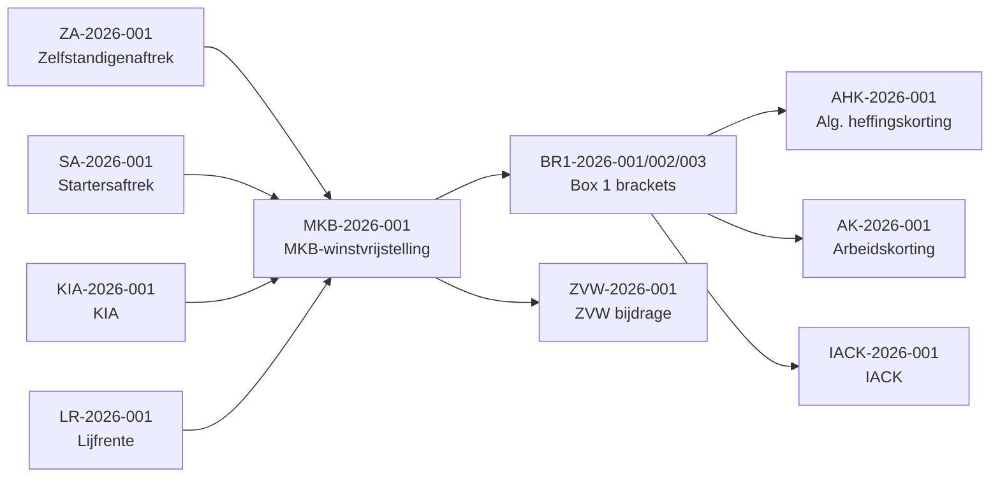

# Rule Engine Domain Model — TaxWijs

> Defines the domain model for the TaxWijs tax rule engine: rule structure, ID conventions, evaluation order, inter-rule dependencies, and the 2026 active rule set.

---

## 1. Rule Record Structure

Every tax rule is stored as a JSON object conforming to `phase1/data/schemas/tax_rule.schema.json`.

```json
{
  "id": "ZA-2026-001",
  "title": "Zelfstandigenaftrek 2026",
  "category": "deduction",
  "user_types": ["zzp"],
  "tax_year": 2026,
  "effective_from": "2026-01-01",
  "effective_until": null,
  "supersedes": "ZA-2025-001",
  "condition": {
    "required": {
      "is_entrepreneur": true,
      "hours_per_year_gte": 1225
    },
    "optional_modifiers": {
      "aow_age": {
        "description": "AOW-leeftijd: only 50% applies",
        "modifier": 0.5
      }
    }
  },
  "result": {
    "type": "deduction",
    "amount": 1200,
    "formula": null,
    "ceiling_income": null
  },
  "plain_nl": "De zelfstandigenaftrek bedraagt €1.200 in 2026 voor ondernemers met minimaal 1.225 uur per jaar.",
  "plain_en": "The self-employment deduction is €1,200 in 2026 for entrepreneurs working at least 1,225 hours per year.",
  "plain_fa": "کسر مالیاتی خوداشتغالی در سال ۲۰۲۶ برابر ۱٬۲۰۰ یورو است برای کارآفرینانی که حداقل ۱٬۲۲۵ ساعت در سال کار می‌کنند.",
  "ai_prompt_hint": "ALWAYS verify urencriterium (1225 hrs/year) before applying this deduction. If hours are unknown, ask clarifying question instead of assuming eligibility.",
  "tags": ["zelfstandigenaftrek", "zzp", "ondernemersaftrek", "urencriterium"],
  "source_url": "https://www.belastingdienst.nl/wps/wcm/connect/bldcontentnl/belastingdienst/zakelijk/winst/zelfstandigenaftrek/",
  "legal_reference": "Wet IB 2001 art. 3.76",
  "source_status": "VERIFIED",
  "verification_status": "verified",
  "notes": "Reduced from €2,470 in 2025. Phasing down to €0 by 2030 per Belastingplan 2023."
}
```

---

## 2. Field Definitions

| Field | Type | Description |
|-------|------|-------------|
| `id` | string | `{TOPIC}-{YEAR}-{SEQ:03d}` — deterministic, never auto-generated |
| `title` | string | Short human-readable title |
| `category` | string | `box1_bracket`, `deduction`, `credit`, `social_insurance`, `vat`, `toeslag`, `compliance` |
| `user_types` | string[] | `zzp`, `employee`, `expat`, `dga` — which personas this rule applies to |
| `tax_year` | int | 2026 (year-isolated; never assumed to carry over) |
| `effective_from` | ISO date | When this rule version took effect |
| `effective_until` | ISO date or null | When this rule expires; null = indefinite |
| `supersedes` | string or null | ID of the prior year rule this replaces |
| `condition` | object | Structured conditions using `required`, `range`, `flag`, `computed` operators |
| `result` | object | `type` (deduction/credit/bracket/rate/compliance), `amount`, `formula`, `ceiling_income` |
| `plain_nl/en/fa` | string | Human-readable description in 3 languages |
| `ai_prompt_hint` | string | Instructions to AI about how to use this rule — **must appear in all prompts** |
| `tags` | string[] | Searchable keywords |
| `source_url` | string | Authoritative source URL (belastingdienst.nl or wetten.overheid.nl) |
| `legal_reference` | string | Article reference (e.g., "Wet IB 2001 art. 3.76") |
| `source_status` | string | `VERIFIED`, `UNSPECIFIED`, `PENDING_REVIEW` |
| `verification_status` | string | `verified`, `pending_review`, `draft` — hard gate for serving to users |

---

## 3. ID Naming Convention

Format: `{TOPIC}-{YEAR}-{SEQ:03d}`

| Topic Code | Meaning |
|------------|---------|
| `BOX` | Box detection rules |
| `BR1` | Box 1 tax brackets |
| `ZA` | Zelfstandigenaftrek |
| `SA` | Startersaftrek |
| `MKB` | MKB-winstvrijstelling |
| `KIA` | Kleinschaligheidsinvesteringsaftrek |
| `LR` | Lijfrente/jaarruimte |
| `ZVW` | Zorgverzekeringswet bijdrage |
| `AHK` | Algemene heffingskorting |
| `AK` | Arbeidskorting |
| `IACK` | Inkomensafhankelijke combinatiekorting |
| `B2R` | Box 2 rate |
| `B3R` | Box 3 fictitious return |
| `BTW` | BTW/VAT rules |
| `KOR` | Kleineondernemersregeling |
| `ZT` | Zorgtoeslag |
| `HT` | Huurtoeslag |
| `WD` | Wet DBA |
| `DL` | Deadline rules |
| `EXP` | Expat / 30% ruling |
| `DGA` | DGA / BV rules |

---

## 4. Condition Expression Patterns

```json
// Range condition
"condition": {
  "required": {
    "taxable_income_box1_range": [0, 38883]
  }
}

// Flag condition
"condition": {
  "required": {
    "is_entrepreneur": true,
    "hours_per_year_gte": 1225
  }
}

// Phase-out (computed)
"condition": {
  "phase_out": {
    "starts_at": 45592,
    "ends_at": 132920,
    "rate_per_euro": 0.0651
  }
}

// Ceiling
"result": {
  "ceiling_income": 79409,
  "rate": 0.0485
}
```

---

## 5. Rule Evaluation Order

Rules must be evaluated in this order to avoid dependency errors:

```
1. BOX-2026-001/002/003   — Determine which box income falls into
2. ZA-2026-001            — Zelfstandigenaftrek (requires is_entrepreneur + hours)
3. SA-2026-001            — Startersaftrek (requires ZA to be applicable)
4. KIA-2026-001           — KIA (independent, requires investment amounts)
5. LR-2026-001            — Lijfrente (requires income after step 2-4)
6. → oa_total = ZA + SA + KIA + LR
7. → profit_after_oa = gross_profit - oa_total
8. MKB-2026-001           — Applied to profit_after_oa (not to gross_profit)
9. → taxable_box1 = profit_after_oa * (1 - 0.127)
10. ZVW-2026-001          — On profit_after_oa (not on taxable_box1)
11. BR1-2026-001/002/003  — Box 1 tax brackets on taxable_box1
12. AHK-2026-001          — Heffingskorting (phase-out by aggregate income)
13. AK-2026-001           — Arbeidskorting (phase-out above €45,592)
14. IACK-2026-001         — Only if has_child_under_12
15. B2R-2026-001/002      — Box 2 (only for DGA with dividend)
16. B3R-2026-001          — Box 3 (only if assets > €59,357 per person)
17. ZT-2026-001           — Zorgtoeslag eligibility check
18. HT-2026-001           — Huurtoeslag eligibility check
19. WD-2026-001           — Wet DBA risk score (advisory, not tax calculation)
```

---

## 6. Active 2026 Rules (All 28)

| ID | Description | Category | User Types |
|----|-------------|----------|-----------|
| BOX-2026-001 | Box 1 detection (work/business income) | box_detection | all |
| BOX-2026-002 | Box 2 detection (≥5% shareholding) | box_detection | dga |
| BOX-2026-003 | Box 3 detection (assets >€59,357) | box_detection | all |
| BR1-2026-001 | Box 1 bracket 1: 35.75% on €0–€38,883 | box1_bracket | all |
| BR1-2026-002 | Box 1 bracket 2: 37.56% (AOW age only) | box1_bracket | all |
| BR1-2026-003 | Box 1 bracket 3: 49.50% above €78,426 | box1_bracket | all |
| ZA-2026-001 | Zelfstandigenaftrek €1,200 | deduction | zzp |
| SA-2026-001 | Startersaftrek €2,123 — LAST YEAR 2026 | deduction | zzp |
| MKB-2026-001 | MKB-winstvrijstelling 12.7% | deduction | zzp |
| KIA-2026-001 | KIA 28% on €2,901–€70,602 investments | deduction | zzp |
| LR-2026-001 | Lijfrente jaarruimte 30% × (income − €19,172) | deduction | all |
| ZVW-2026-001 | ZVW bijdrage 4.85% on profit after OA | social_insurance | zzp |
| AHK-2026-001 | Algemene heffingskorting €3,115 max | credit | all |
| AK-2026-001 | Arbeidskorting €5,685 max | credit | all |
| IACK-2026-001 | IACK €3,032 max (child under 12) | credit | all |
| B2R-2026-001 | Box 2 low rate 24.5% up to €68,843 | box2_rate | dga |
| B2R-2026-002 | Box 2 high rate 31% above €68,843 | box2_rate | dga |
| B3R-2026-001 | Box 3: savings 1.28%, investments 6%, rate 36% | box3_rate | all |
| BTW-2026-001 | BTW standard rate 21% | vat | zzp, dga |
| BTW-2026-002 | BTW reduced rate 9% (accommodation → 21% in 2026) | vat | zzp, dga |
| KOR-2026-001 | KOR VAT exemption threshold €20,000 | vat | zzp |
| ZT-2026-001 | Zorgtoeslag €129/mo, cutoff €40,857 single | toeslag | all |
| HT-2026-001 | Huurtoeslag — 2026 reform: no rent ceiling | toeslag | all |
| WD-2026-001 | Wet DBA enforcement — active since Jan 2025 | compliance | zzp |
| DL-2026-001 | BTW quarterly deadlines (Q1: 30 April) | compliance | zzp, dga |
| DL-2026-002 | IB return deadline: 1 May 2026 (for tax year 2025) | compliance | all |
| EXP-2026-001 | 30% ruling 5-year phase-down (yr1-3: 30%, yr4: 20%, yr5: 10%) | deduction | expat |
| DGA-2026-001 | DGA gebruikelijk loon minimum €56,000 | compliance | dga |

---

## 7. Inter-Rule Dependencies



**Key dependency:** MKB-winstvrijstelling must be applied AFTER all ondernemersaftrek deductions (ZA + SA + KIA + LR). The 12.7% exemption is calculated on `profit_after_ondernemersaftrek`, NOT on gross profit.
