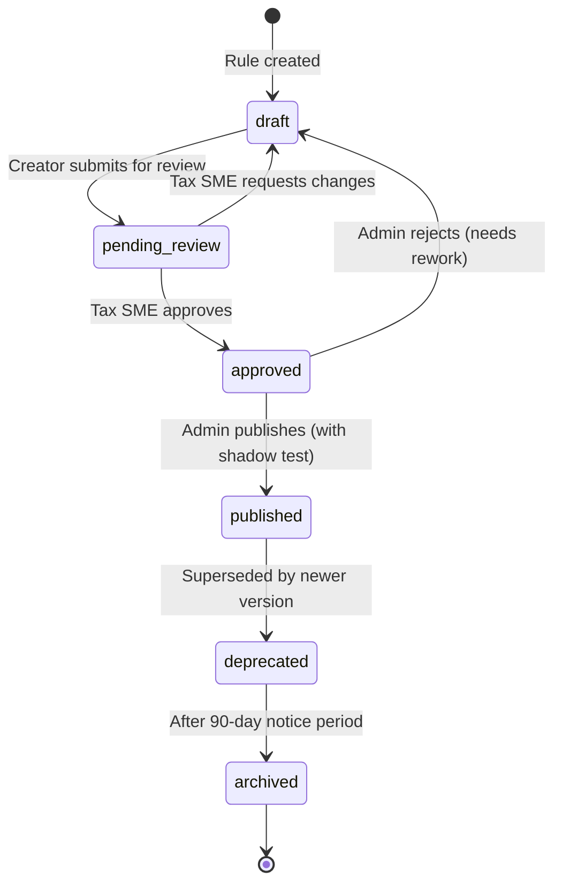

# Rule Versioning and Governance — TaxWijs

> How tax rules are created, versioned, approved, published, deprecated, and retired. Covers the full governance lifecycle from annual law publication to production deployment.

---

## 1. Version Lifecycle



---

## 2. Semantic Versioning for Rules

Rules use `MAJOR.MINOR` versioning stored in `rule_versions` table:

| Change Type | Version Bump | Example |
|-------------|-------------|---------|
| New condition added | MAJOR | Adding MFA requirement to an exemption |
| Rate/threshold value changes | MINOR | Zelfstandigenaftrek €2,470 → €1,200 |
| Text correction (no logic change) | MINOR | Plain language wording update |
| New user_type added | MAJOR | Extending a ZZP rule to also cover DGA |
| Effective date change | MINOR | Postponing enforcement date |

Each `rule_versions` row is immutable after creation. A new row is always created for every change.

---

## 3. Approval Workflow

### 3.1 Participants

| Role | Responsibility |
|------|---------------|
| Tax Analyst | Creates draft rules, updates values from official sources |
| Tax SME (Subject Matter Expert) | Reviews legal accuracy, source provenance, edge cases |
| Firm Manager / Admin | Final approval gate, publishes to production |
| Engineer | Adds/updates test cases, runs regression suite |

### 3.2 Checklist (must be completed before approval)

- [ ] Legal reference verified (Wet IB 2001 article, Besluit, or Belastingplan) 
- [ ] Source URL accessible and matches rule content
- [ ] `source_status` set to `VERIFIED` (not `UNSPECIFIED`)
- [ ] All three language versions (`plain_nl`, `plain_en`, `plain_fa`) are accurate
- [ ] `ai_prompt_hint` correctly guides AI behavior for this rule
- [ ] Minimum 2 test cases added to `rule_test_cases`
- [ ] All existing test cases still pass
- [ ] Retroactive analysis: does this rule change affect filed returns from prior periods?
- [ ] If `effective_until` is set: confirm date is correct (e.g., SA-2026-001 ends 2026-12-31)
- [ ] If this supersedes a prior rule: `supersedes` field is populated with prior rule ID

### 3.3 Review Flow Steps

1. **Draft:** Tax Analyst creates rule in Django admin or via API with `verification_status=draft`
2. **Submit:** Analyst marks as `pending_review`; Tax SME receives notification
3. **Review:** SME reviews against checklist; either approves or requests changes
4. **Approve:** SME sets status to `approved`; Admin receives notification
5. **Shadow test:** Admin enables `shadow_mode=true` — rule runs in parallel with existing rule; comparison report generated for 48 hours
6. **Publish:** If shadow test passes, Admin publishes; rule status → `published`; `effective_from` must be ≤ today
7. **Notify:** All accountant users receive notification of rule change with summary

---

## 4. Shadow Mode

Shadow mode allows a new rule version to run alongside the current published version without affecting user-facing output.

```python
# In the calculator, when shadow_mode=True for a new rule version:
current_result = calculate_with(current_published_rule, profile)
shadow_result = calculate_with(new_draft_rule, profile)

if current_result != shadow_result:
    log_shadow_divergence(rule_id, profile, current_result, shadow_result)
    # Do NOT apply shadow result to user output
```

Shadow test passes when:
- Zero divergence on all 6 seed scenarios
- Divergence rate < 2% on sampled live engagements
- All `rule_test_cases` for the new version pass

---

## 5. Annual Update Cadence

Dutch tax law is published by the Eerste Kamer each September for the following tax year.

| Month | Activity |
|-------|---------|
| September | Prinsjesdag: annual Belastingplan published. Tax Analyst begins rule drafts for new year. |
| October | Rule drafts created, test cases written, SME review initiated |
| November | Shadow mode testing against anonymized engagement data |
| December | Admin publishes new year rules; embedding re-index run; CLAUDE.md updated |
| January | New tax year active; prior year rules remain available for historical queries |

---

## 6. Deprecation Policy

1. Deprecated rules remain in ChromaDB with a `⚠️ DEPRECATED` prefix in the chunk text
2. 90-day notice period: rule stays retrievable but AI receives a warning hint
3. After 90 days: rule status → `archived`; removed from active retrieval (still in DB for audit)
4. `supersedes` chain maintained: ZA-2027-001.supersedes = "ZA-2026-001"
5. Accountants who used deprecated rules on filed returns are not affected (rules are point-in-time)

---

## 7. Rollback Procedure

If a published rule causes errors:

1. Admin sets `rule_versions.status` of the bad version → `deprecated`
2. Restore prior version: find previous `rule_versions` row where `status=published`, re-publish it
3. Increment `version_minor` on the restored version (to create clean audit trail)
4. Run `phase2/build_index.py` to re-index with corrected rule
5. Run `phase3/test_scenarios.py` to verify all 6 scenarios still pass
6. Notify all accountants via system announcement

---

## 8. Test Case Strategy

Every rule must have ≥ 2 test cases. Test cases are stored in `rule_test_cases`:

```json
{
  "rule_id": "uuid-of-ZA-2026-001",
  "description": "ZZP with 1,300 hours — should get full deduction",
  "input_profile": {
    "user_type": "zzp",
    "gross_profit": 50000,
    "hours_per_year": 1300,
    "is_starter": false
  },
  "expected_output": {
    "zelfstandigenaftrek": 1200
  },
  "tolerance": 0.0
}
```

Test cases are run:
- On every rule version change (CI gate)
- Before shadow mode is enabled
- After every Phase 1 data change

---

## 9. Who Can Do What

| Action | Tax Analyst | Tax SME | Firm Manager | Admin | Engineer |
|--------|------------|---------|-------------|-------|---------|
| Create draft | ✅ | ✅ | ❌ | ✅ | ✅ |
| Submit for review | ✅ | ❌ | ❌ | ✅ | ❌ |
| Approve | ❌ | ✅ | ❌ | ✅ | ❌ |
| Enable shadow mode | ❌ | ❌ | ❌ | ✅ | ✅ |
| Publish | ❌ | ❌ | ✅ | ✅ | ❌ |
| Deprecate | ❌ | ❌ | ✅ | ✅ | ❌ |
| Archive | ❌ | ❌ | ❌ | ✅ | ❌ |
| Add test cases | ✅ | ✅ | ❌ | ✅ | ✅ |
| Run test cases | ✅ | ✅ | ❌ | ✅ | ✅ |
