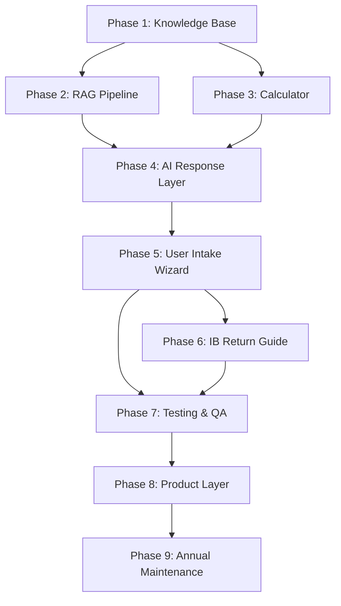

# Dependencies Map — TaxWijs

> What must be done before what. Use this to avoid blocked work.

---

## Phase Dependencies

---

## Technical Dependencies

| Component | Depends On | Blocks |
|-----------|-----------|--------|
| `phase2/retriever.py` | `phase2/store/chroma_store.py` built + indexed | `apps/ai/views.py` (chat endpoint) |
| `phase3/calculator.py` | `phase1/data/seed/tax_rules_2026.json` valid | `apps/ai/calculator.py` + `apps/ai/views.py` |
| `apps/ai/chat.py` | Phase 2 retriever + Phase 3 calculator | AI chat UI, deduction scanner |
| `apps/portal/services/readiness.py` | `checklist_item_states` + `document_requests` models | Engagement workspace UI |
| `schema/postgres/schema.sql` | Nothing | All Django models (must match) |
| `ChromaDB index` | `phase2/build_index.py` run at least once | Any RAG retrieval |
| `ANTHROPIC_API_KEY` in env | Nothing | Any Claude API call (mock mode if missing) |
| `OPENAI_API_KEY` in env | Nothing | OpenAI embeddings (falls back to local model) |
| Document classification | OCR pipeline complete | Field extraction |
| Field extraction | Document classification | Human review queue |
| Human review | Field extraction | Readiness score update |

---

## External Dependencies

| External Service | Used By | If Unavailable |
|-----------------|---------|---------------|
| Anthropic Claude API | Phase 4 chat + document classification | Mock mode activated automatically |
| AWS Textract | Document OCR | Manual upload path (no extraction) |
| Supabase | Production database | SQLite (dev), Django can't deploy to prod |
| Redis | Celery task queue | Synchronous processing (slow, no queue) |
| S3-compatible storage | Document files | Local file storage (dev only) |

---

## Data Dependencies

| Data | Must Exist Before | Created By |
|------|------------------|-----------|
| `tax_rules_2026.json` (28 rules) | Phase 2 (chunking), Phase 3 (calculator) | Phase 1 manual curation |
| `qa_pairs_2026.json` (12 pairs) | Phase 2 (Q&A chunks, test precision) | Phase 1 manual curation |
| `scenarios.json` (6 scenarios) | Phase 3 (accuracy test) | Phase 1 manual curation |
| `ib_form_mapping.json` (9 fields) | Phase 2 (IB chunks), Phase 6 | Phase 1 manual curation |
| ChromaDB index | Any RAG query | `python phase2/build_index.py` |
| Checklist templates (DB seed) | Any engagement creation | `schema/postgres/seed-reference-data.sql` |
| Role + permission seed data | Any authenticated request | `schema/postgres/seed-reference-data.sql` |
