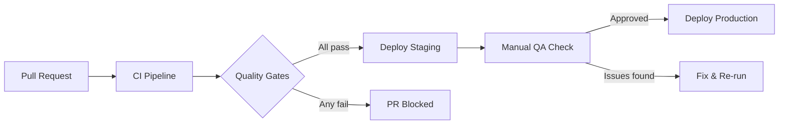

# CI/CD Strategy — TaxWijs

> Pipeline design, quality gates, deployment triggers, and rollback approach.

---

## 1. Pipeline Overview



---

## 2. CI Pipeline (`.github/workflows/ci.yml`)

Triggered on: every PR + push to `main`

| Step | Tool | Pass Criteria |
|------|------|--------------|
| Backend lint | Ruff | 0 violations |
| Backend tests | pytest | 0 failures + ≥80% coverage |
| Phase 1 validation | validate.py | 100% pass |
| Phase 2 RAG gates | test_retrieval.py | precision@5 ≥95%, all 5 gates |
| Phase 3 accuracy | test_scenarios.py | 0.0% error, all 6 scenarios |
| Frontend type check | `tsc --noEmit` | 0 TypeScript errors |
| Frontend build | `npm run build` | Exit 0 |
| Frontend tests | Vitest | 0 failures |
| OpenAPI lint | Spectral | 0 errors |
| DB schema validate | `db-validate.yml` | Migration file matches schema.sql |
| API contract check | `api-contract-check.yml` | OpenAPI endpoints match Django URLs |

Estimated CI runtime: ~4 minutes

---

## 3. Staging Deployment

Triggered on: merge to `main`

```yaml
# .github/workflows/deploy-staging.yml
on:
  push:
    branches: [main]

steps:
  - name: Run migrations
    run: python manage.py migrate --noinput
  
  - name: Re-index RAG corpus (if phase1/ changed)
    run: |
      if git diff HEAD~1 --name-only | grep phase1/; then
        python phase2/build_index.py
      fi
  
  - name: Deploy Django to Railway (staging)
    run: railway up --environment staging
  
  - name: Deploy frontend to Cloudflare Pages (staging)
    run: npx wrangler pages deploy dist/ --project taxwijs-staging
```

---

## 4. Production Deployment

Triggered on: Git tag push (`v*.*.*`)

```yaml
# .github/workflows/deploy-production.yml
on:
  push:
    tags:
      - 'v*.*.*'

steps:
  - name: Run all CI checks (re-run on tag)
    uses: ./.github/workflows/ci.yml
  
  - name: Run database migrations
    run: python manage.py migrate --noinput
  
  - name: Deploy to production
    run: railway up --environment production
  
  - name: Smoke test
    run: |
      curl -f https://api.taxwijs.nl/api/health/ || exit 1
      curl -f https://app.taxwijs.nl/ || exit 1
  
  - name: Notify on failure
    if: failure()
    run: # send Slack/email alert
```

---

## 5. Secrets Management in CI

Secrets stored in GitHub repository secrets:

| Secret | Used By |
|--------|---------|
| `ANTHROPIC_API_KEY` | AI tests, Phase 4 |
| `OPENAI_API_KEY` | Phase 2 embedding tests (optional) |
| `DATABASE_URL_STAGING` | Staging migration |
| `DATABASE_URL_PRODUCTION` | Production migration |
| `RAILWAY_TOKEN` | Railway deployments |
| `CLOUDFLARE_API_TOKEN` | Frontend deployments |
| `SENTRY_DSN` | Error reporting |

---

## 6. Branch Protection Rules

On `main`:
- Require PR (no direct commits)
- Require CI to pass before merge
- Require at least 1 reviewer (once team > 1)
- No force push
- No deletion
